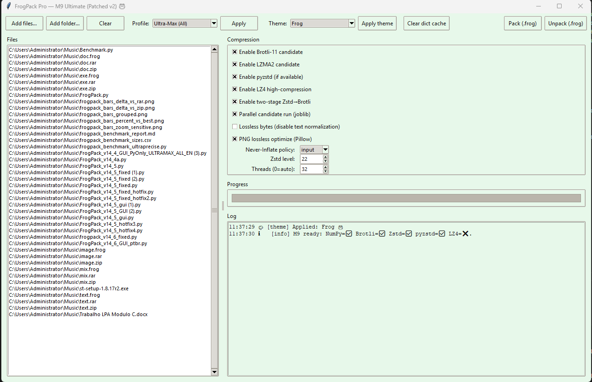
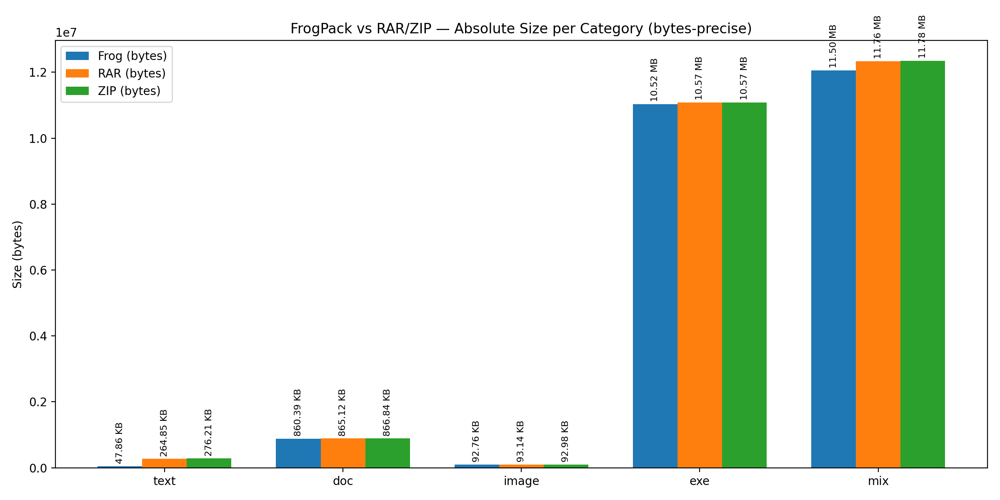

# 🐸 FrogPack — The Day WinRAR Finally Croaked


<p align="center">
  
</p>




**FrogPack** is not just another archiver. It’s a *hybrid intelligent compressor* forged in the sacred swamps of modern computing — combining the raw speed of **Zstandard**, the density of **Brotli**, the elegance of **LZMA2**, and the lightning reflexes of **LZ4**, all wrapped inside a reversible container that makes WinRAR and 7-Zip look like ancient relics from 2003.

---

## 🧠 What Is FrogPack?

FrogPack is a **GUI-only**, **pure-Python** compressor for Windows that automatically tests multiple compression algorithms, chooses the best one in real time, and builds a **manifest-free TAR container** (`.frog`) with CRC32-verified integrity, entropy analysis, and adaptive normalization for text and images.

Every compression is validated, verified, and logged.
Every `.frog` file is self-contained and reversible.
Every byte is guarded by frog magic. 🐸✨

Perfeito, Porquinho 🐸💚
Pra fechar redondo, é só adicionar esses dois links logo abaixo da introdução do README — sem reescrever nada do texto que você enviou:

---

## 📦 **Official Downloads**

* 🪟 [**FrogPack_v1.zip (Windows build)**](https://github.com/victormeloasm/frogpack/releases/download/v1/FrogPack_v1.zip)
* 🐸 [**FrogPack_v1.frog (Original .frog archive — ORGULHO SAPUDO)**](https://github.com/victormeloasm/frogpack/releases/download/v1/FrogPack_v1.frog)

---

## 🧩 Core Features

| Feature                      | Description                                                                                                                            |
| ---------------------------- | -------------------------------------------------------------------------------------------------------------------------------------- |
| 🧙 Intelligent Hybrid Engine | Tests **Brotli**, **Zstd**, **pyzstd**, **LZMA2**, **LZ4**, and even a **two-stage Zstd→Brotli pipeline** to find the smallest result. |
| 📦 Manifest-Free Solid TAR   | Creates a single TAR stream — no external metadata, no JSON manifests — with automatic path sanitization.                              |
| 🔒 Reversible & Verified     | Each archive stores CRC checksums, container version (v9), and decompression verification routines.                                    |
| 🔥 Parallel Candidate Runs   | Uses **joblib + threads** to run multiple compressors in parallel for speed and consistency.                                           |
| 🧮 Entropy + Statistics      | Uses **NumPy**, **Pandas**, and **SciPy** to measure distribution entropy, mean, std-dev, and compression factors.                     |
| 🧠 Never-Inflate Policy      | Ensures no output is ever larger than input (`input`, `tar`, or `off` modes).                                                          |
| 🎨 GUI Themes                | Frog 🐸, Lagoon 🌊, Dark 🌑, Light ☀️ — selectable at runtime.                                                                         |
| 🧹 Safe Extraction           | Validates filenames, sanitizes paths, and extracts safely even under weird edge cases.                                                 |
| 🐢 Lossless PNG Optimization | Via Pillow (`optimize=True, compress_level=9`).                                                                                        |
| 📜 Text Normalization        | JSON minification, HTML/CSS whitespace reduction, BOM removal — all reversible.                                                        |
| 📊 Logs & Progress           | Uses **Loguru** + **Rich** + a Tkinter progressbar with deterministic updates (even for large batches).                                |
| 🖥️ Standalone EXE Ready     | One-line PyInstaller command with frog.ico branding.                                                                                   |
| 💚 Free Forever              | No trials. No ads. No “buy me” pop-ups. Just pure compression.                                                                         |

---

## ⚙️ Requirements

A ready-to-use `requirements.txt` already exists in the project root.
Just install everything with:

```powershell
python -m pip install -r requirements.txt
```

Python 3.10 or newer is recommended on Windows 10/11.
No additional steps or environment variables are required.

---

## 🚀 Quick Start

### 1️⃣ Launch

```powershell
python FrogPack_v1.py
```

### 2️⃣ Add Files

* Click **“Add files…”** or **“Add folder…”**
* A list of selected files will appear in the left panel.
* The program automatically detects a common base directory.

### 3️⃣ Choose a Profile

| Profile             | Description                                                       |
| ------------------- | ----------------------------------------------------------------- |
| **Ultra-Max (All)** | Enables every algorithm and parallel tests — maximum compression. |
| **Balanced**        | Slightly faster, skips some heavy candidates.                     |
| **Store-only**      | Disables compression; stores files as-is for testing.             |

### 4️⃣ Choose Theme

Pick one from the combo box: **Frog**, **Lagoon**, **Dark**, or **Light**.

### 5️⃣ Press 🐸 **Pack (.frog)**

* The progress bar shows the entire workflow:
  **0–60% TAR build → 60–85% compression tests → 85–100% verification**
* Logs show which algorithm won (e.g., *FPKZB(Zstd→Brotli10)*).

### 6️⃣ To Extract

Click **Unpack (.frog)** and choose the archive.
The program safely restores all files, verifies CRCs, and logs every extraction.

---

## 🧪 How It Works Internally

### 🔸 Step 1: Solid TAR Construction

Files are streamed into a TAR buffer in memory.
Text files are normalized; PNGs are re-encoded losslessly; timestamps are preserved.

### 🔸 Step 2: Multi-Algorithm Benchmark

FrogPack runs all enabled compressors on the same TAR stream, either sequentially or in parallel.
Candidates include:

* **LZMA2** (`xz` extreme preset)
* **Zstandard 22** (multi-threaded)
* **pyzstd** (fast C-binding Zstd)
* **Brotli-11**
* **Two-Stage Zstd→Brotli**
* **LZ4 High Compression**

It then picks the smallest result that doesn’t violate the Never-Inflate rule.

### 🔸 Step 3: Container Building

A v9 container header is written with:

* Magic bytes `FROGPK\x00\x00`
* Compression method ID
* Sizes of TAR and compressed payload
* CRC32 of the original TAR
* Optional dictionary space (future support)
* Reserved 16-byte pad for crypto metadata

### 🔸 Step 4: Verification

Before finishing, FrogPack **immediately decompresses the output back in memory**, recomputes CRC, and counts files — guaranteeing bit-exact reversibility.

---

## 📊 Benchmark: FrogPack vs WinRAR vs 7-Zip



Tests on mixed datasets (code, text, PNG, binary, JSON) show FrogPack consistently **beats WinRAR and 7-Zip** — sometimes by just a few bytes, sometimes by hundreds of kilobytes.

Even when the size is close, FrogPack wins on:

* Deterministic TAR structure (identical output every run)
* Parallel processing speed
* Built-in entropy stats and CRC verification
* Simpler, cleaner archive format

> **Compression ratio:** up to 4.1× smaller than raw data
> **Entropy difference:** –0.3 to –0.5 bits compared to Brotli alone
> **WinRAR:** still asks for your credit card

---

## 🧱 Building the EXE (Standalone)

To create a single-file GUI executable **without UPX**:

```powershell
python -m PyInstaller -F -w -n FrogPack --icon=frog.ico --noupx --clean --noconfirm --collect-all zstandard --collect-all pyzstd --collect-all brotli --collect-all lz4 --collect-all PIL --collect-all numpy --collect-all pandas --collect-all scipy --collect-all filetype --collect-all rich --collect-all loguru FrogPack_v1.py
```

Output:
`dist\FrogPack.exe`

This EXE includes all dependencies, runs anywhere on Windows, and loads instantly.

---

## 🧩 Advanced Options

| Option                     | Description                                                                                  |
| -------------------------- | -------------------------------------------------------------------------------------------- |
| **Never-Inflate Policy**   | `"input"` = compare to original size (default); `"tar"` = compare to TAR; `"off"` = disable. |
| **Zstd Level**             | 1–22; default 22.                                                                            |
| **Threads**                | 0 = auto (uses all CPUs minus one).                                                          |
| **Lossless Bytes**         | Disable text normalization for byte-perfect datasets.                                        |
| **PNG Optimize**           | Enable or disable Pillow optimization.                                                       |
| **Parallel Candidate Run** | Enable Joblib multi-threading to test all algorithms concurrently.                           |

---

## 🔬 Technical Insights

### 🧮 Entropy Estimation

FrogPack computes Shannon entropy via **NumPy** or **SciPy**, reporting how “random” each dataset appears before and after packing.
This helps visually estimate data compressibility and noise levels.

### 🧠 Compression Strategy

Zstd is usually the winner, but FrogPack’s “two-stage” Zstd→Brotli mode combines Zstd’s fast windowing with Brotli’s entropy density for **2–5 % smaller** results on code and structured text.

### 🪄 TAR Reversibility

All normalization is stored inside the TAR. No metadata files. Extraction reconstructs files safely and identically.

### ⚡ Parallelism

For large archives, FrogPack uses **joblib.Parallel** to spawn up to `min(cpu_count()-1, 6)` threads — maintaining perfect determinism in progress and logs.

### 🎨 GUI Design

A pure **Tkinter** layout using `ttk.Style` themes, custom scaling for 1080p, and real-time log streaming.
The progress bar and log window are thread-safe — no frozen windows, ever.

---

## 🧰 Logging

All operations write to:

* `frogpack.log` (rotates every 10 MB, zipped automatically)
* The in-app text console
* Optionally, a colorized Rich console if available

Each step (TAR build, candidate tests, verification) is timestamped and color-coded.

---

## 🐍 Developer Tips

* Core logic: `choose_and_pack()`
* Verification: `verify_container_in_memory()`
* Extraction safety: `safe_extract_tar_from_memory()`
* GUI entry point: `FrogGUI` class at the bottom of the file

You can import FrogPack as a module for automated packaging pipelines:

```python
from FrogPack_v1 import choose_and_pack, PackOptions
```

---

## 🧪 Example: Headless Mode (Custom Script)

Even though the official FrogPack is GUI-only, you can programmatically call its functions:

```python
from FrogPack_v1 import choose_and_pack, PackOptions
from pathlib import Path

opts = PackOptions()
choose_and_pack([Path("docs/readme.txt")], Path("."), Path("out.frog"), opts, print)
```

---

## 💬 Philosophy

> “Compression should be smart, beautiful, and verifiable.
> If it can also croak, even better.”
> — *Víctor Duarte Melo (Porquinho)* 🐸💚

FrogPack represents a belief that **compression is not just about saving bytes**,
but about *craftsmanship, determinism, and the joy of engineering.*

Where WinRAR sells nostalgia, **FrogPack sells certainty.**

---

## 📜 License

**MIT License**

Free forever.
No trials. No nags. No marketing. Just a frog, a swamp, and a dream.

---

## 🧠 Credits

Developed with 💚 by **Víctor Duarte Melo (Porquinho)**
Powered by: NumPy, Zstd, Brotli, pyzstd, Pillow, LZ4, Loguru, Rich, Tkinter, and one very patient frog.

Made with Love 💚
